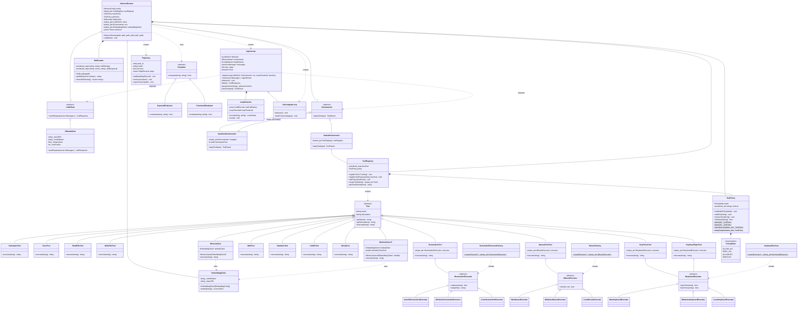

```mermaid
classDiagram
    direction TB

    class LLMClient {
        <<abstract>>
        +sendRequest(vector~Message~)* LLMResponse
    }

    class OllamaClient {
        -string _baseURL
        -string _modelName
        -float _temperature
        -int _numPredict
        +sendRequest(vector~Message~) LLMResponse
    }

    class EmbeddingClient {
        -string _modelName
        -string _baseURL
        +EmbeddingClient(EmbeddingConfig)
        +embed(string) vector~float~
    }

    class Environment {
        <<abstract>>
        +step(ToolInput)* ToolResult
    }

    class NativeEnvironment {
        -shared_ptr~ToolRegistry~ toolRegistry
        +step(ToolInput) ToolResult
    }

    class SandboxEnvironment {
        -unique_ptr~Environment~ wrapped
        -fs::path workspaceRoot
        +step(ToolInput) ToolResult
    }

    class Tool {
        <<abstract>>
        #string name
        #string description
        +getName() string
        +getDescription() string
        +execute(string)* string
    }

    class CalculatorTool {
        +execute(string) string
    }

    class ExecTool {
        +execute(string) string
    }

    class ReadFileTool {
        +execute(string) string
    }

    class WriteFileTool {
        +execute(string) string
    }

    class MemorySave {
        -EmbeddingClient* embedClient
        +MemorySave(EmbeddingClient*)
        +execute(string) string
    }

    class MemorySearch {
        -EmbeddingClient* embedClient
        -double similarityThreshold
        +MemorySearch(EmbeddingClient*, double)
        +execute(string) string
    }

    class WebTool {
        +execute(string) string
    }

    class DatetimeTool {
        +execute(string) string
    }

    class ListDirTool {
        +execute(string) string
    }

    class StringTool {
        +execute(string) string
    }

    class ScreenshotTool {
        -unique_ptr~IScreenshotExecutor~ executor
        +execute(string) string
    }

    class MouseClickTool {
        -unique_ptr~IMouseExecutor~ executor
        +execute(string) string
    }

    class KeyPressTool {
        -unique_ptr~IKeyboardExecutor~ executor
        +execute(string) string
    }

    class KeyboardTypeTool {
        -unique_ptr~IKeyboardExecutor~ executor
        +execute(string) string
    }

    class IScreenshotExecutor {
        <<abstract>>
        +capture(string)* bool
        +setupHint()* string
    }

    class IMouseExecutor {
        <<abstract>>
        +click(int, int)* bool
    }

    class IKeyboardExecutor {
        <<abstract>>
        +typeText(string)* bool
        +keyPress(string)* bool
    }

    class ScreenshotExecutorFactory {
        +createExecutor()$ unique_ptr~IScreenshotExecutor~
    }

    class MouseFactory {
        +createExecutor()$ unique_ptr~IMouseExecutor~
    }

    class KeyboardFactory {
        +createExecutor()$ unique_ptr~IKeyboardExecutor~
    }

    class PolicyMode {
        <<enumeration>>
        ALLOW_ALL
        DENY_ALL
        ALLOWLIST
        DENYLIST
    }

    class ToolPolicy {
        -PolicyMode mode
        -unordered_set~string~ toolList
        +setMode(PolicyMode) void
        +addTool(string) void
        +removeTool(string) void
        +isAllowed(string) bool
        +allowAll()$ ToolPolicy
        +denyAll()$ ToolPolicy
        +allowOnly(initializer_list)$ ToolPolicy
        +denyOnly(initializer_list)$ ToolPolicy
    }

    class ToolRegistry {
        -unordered_map factories
        -ToolPolicy policy
        +registerTool~T~(string) void
        +registerToolFactory(string, function) void
        +setPolicy(ToolPolicy) void
        +createTool(string) unique_ptr~Tool~
        +getToolsDescription() string
    }

    class Evaluator {
        <<abstract>>
        +evaluate(string, string)* bool
    }

    class KeywordEvaluator {
        +evaluate(string, string) bool
    }

    class FunctionalEvaluator {
        +evaluate(string, string) bool
    }

    class LoopDetector {
        -vector~CallRecord~ toolCallHistory
        -LoopThreshold loopThreshold
        +record(string, string) LoopStatus
        +reset() void
    }

    class SkillLoader {
        -unordered_map~string, string~ skillStorage
        -unordered_map~string, vector_string~ skillKeywords
        +SkillLoader(path)
        +getSkills(vector~string~) string
        +selectSkills(string) vector~string~
    }

    class AgentLoop {
        #LLMClient* llmClient
        #Environment* environment
        #LoopDetector loopDetector
        #vector~Message~ messages
        #int max_steps
        #function hook
        +AgentLoop(LLMClient*, Environment*, int, LoopThreshold, function)
        +run(vector~Message~) AgentResult
        #observe() void
        #think() LLMResponse
        #parseAction(string) optional~Action~
        #act(ToolInput) ToolResult
    }

    class VisionAgentLoop {
        #observe() void
        -dropPreviousImages() void
    }

    class Trajectory {
        -string task_id
        -string model
        -bool success
        -vector~StepRecord~ steps
        +addStep(StepRecord) void
        +setSuccess(bool) void
        +exportToJson(path) void
    }

    class HarnessRunner {
        -HarnessConfig config
        -shared_ptr~ToolRegistry~ toolRegistry
        -ToolPolicy mainPolicy
        -ToolPolicy guiPolicy
        -SkillLoader skillLoader
        -unique_ptr~LLMClient~ client
        -unique_ptr~Environment~ env
        -unique_ptr~EmbeddingClient~ embeddingClient
        -vector~Task~ tasksList
        +HarnessRunner(path, path, path, path, path, path)
        +runBatch() void
    }

    LLMClient <|-- OllamaClient
    Environment <|-- NativeEnvironment
    Environment <|-- SandboxEnvironment
    AgentLoop <|-- VisionAgentLoop
    Evaluator <|-- KeywordEvaluator
    Evaluator <|-- FunctionalEvaluator

    Tool <|-- CalculatorTool
    Tool <|-- ExecTool
    Tool <|-- ReadFileTool
    Tool <|-- WriteFileTool
    Tool <|-- MemorySave
    Tool <|-- MemorySearch
    Tool <|-- WebTool
    Tool <|-- DatetimeTool
    Tool <|-- ListDirTool
    Tool <|-- StringTool
    Tool <|-- ScreenshotTool
    Tool <|-- MouseClickTool
    Tool <|-- KeyPressTool
    Tool <|-- KeyboardTypeTool

    IScreenshotExecutor <|-- macOSScreenshotExecutor
    IScreenshotExecutor <|-- WindowsScreenshotExecutor
    IScreenshotExecutor <|-- LinuxScreenshotExecutor
    IMouseExecutor <|-- MacMouseExecutor
    IMouseExecutor <|-- WindowsMouseExecutor
    IMouseExecutor <|-- LinuxMouseExecutor
    IKeyboardExecutor <|-- MacKeyboardExecutor
    IKeyboardExecutor <|-- WindowsKeyboardExecutor
    IKeyboardExecutor <|-- LinuxKeyboardExecutor

    AgentLoop *-- LoopDetector
    HarnessRunner *-- SkillLoader
    HarnessRunner *-- ToolPolicy
    ToolRegistry *-- ToolPolicy
    ToolPolicy *-- PolicyMode

    SandboxEnvironment o-- "1" Environment : wraps (Decorator)
    NativeEnvironment o-- ToolRegistry
    HarnessRunner o-- "1" LLMClient
    HarnessRunner o-- "1" Environment
    HarnessRunner o-- "1" ToolRegistry
    HarnessRunner o-- "1" EmbeddingClient
    ScreenshotTool o-- IScreenshotExecutor
    MouseClickTool o-- IMouseExecutor
    KeyPressTool o-- IKeyboardExecutor
    KeyboardTypeTool o-- IKeyboardExecutor

    ToolRegistry ..> Tool : creates
    ScreenshotExecutorFactory ..> IScreenshotExecutor : creates
    MouseFactory ..> IMouseExecutor : creates
    KeyboardFactory ..> IKeyboardExecutor : creates
    HarnessRunner ..> AgentLoop : creates
    HarnessRunner ..> VisionAgentLoop : creates
    HarnessRunner ..> Trajectory : creates
    HarnessRunner ..> Evaluator : uses
    AgentLoop ..> LLMClient : depends
    AgentLoop ..> Environment : depends
    MemorySave ..> EmbeddingClient : uses
    MemorySearch ..> EmbeddingClient : uses
```
