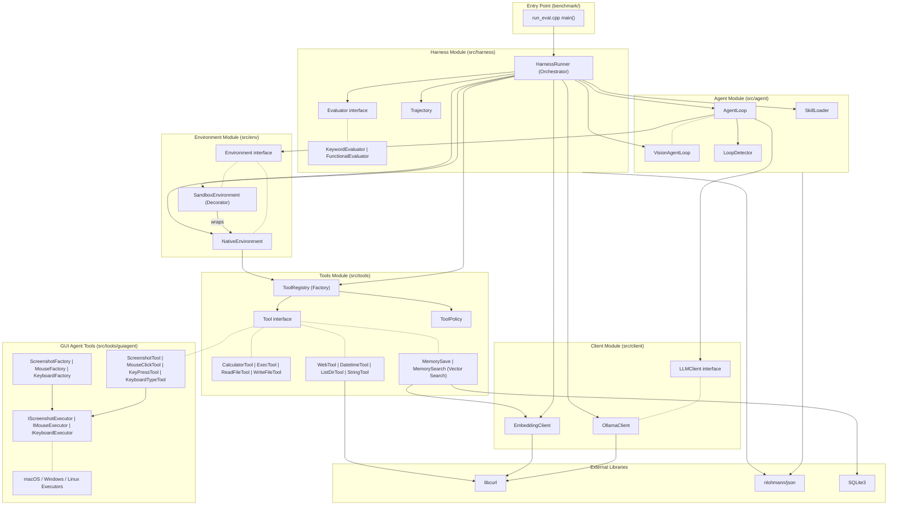

```mermaid
graph TB
    subgraph ENTRY["Entry Point (benchmark/)"]
        run_eval["run_eval.cpp main()"]
    end

    subgraph CLIENT["Client Module (src/client)"]
        LLMClient_i["LLMClient interface"]
        OllamaClient_c["OllamaClient"]
        EmbeddingClient_c["EmbeddingClient"]
        LLMClient_i -.- OllamaClient_c
    end

    subgraph AGENT["Agent Module (src/agent)"]
        AgentLoop_c["AgentLoop"]
        VisionAgentLoop_c["VisionAgentLoop"]
        LoopDetector_c["LoopDetector"]
        SkillLoader_c["SkillLoader"]
        AgentLoop_c -.- VisionAgentLoop_c
        AgentLoop_c --> LoopDetector_c
    end

    subgraph ENV["Environment Module (src/env)"]
        Environment_i["Environment interface"]
        NativeEnv_c["NativeEnvironment"]
        SandboxEnv_c["SandboxEnvironment (Decorator)"]
        Environment_i -.- NativeEnv_c
        Environment_i -.- SandboxEnv_c
        SandboxEnv_c -->|wraps| NativeEnv_c
    end

    subgraph TOOLS["Tools Module (src/tools)"]
        Tool_i["Tool interface"]
        ToolRegistry_c["ToolRegistry (Factory)"]
        ToolPolicy_c["ToolPolicy"]
        BasicTools["CalculatorTool | ExecTool | ReadFileTool | WriteFileTool"]
        ExtTools["WebTool | DatetimeTool | ListDirTool | StringTool"]
        MemTools["MemorySave | MemorySearch (Vector Search)"]
        Tool_i -.- BasicTools
        Tool_i -.- ExtTools
        Tool_i -.- MemTools
        ToolRegistry_c --> Tool_i
        ToolRegistry_c --> ToolPolicy_c
    end

    subgraph GUI["GUI Agent Tools (src/tools/guiagent)"]
        GUITools["ScreenshotTool | MouseClickTool | KeyPressTool | KeyboardTypeTool"]
        Executors["IScreenshotExecutor | IMouseExecutor | IKeyboardExecutor"]
        Factories["ScreenshotFactory | MouseFactory | KeyboardFactory"]
        PlatformImpl["macOS / Windows / Linux Executors"]
        Tool_i -.- GUITools
        GUITools --> Executors
        Factories --> Executors
        Executors -.- PlatformImpl
    end

    subgraph HARNESS["Harness Module (src/harness)"]
        HarnessRunner_c["HarnessRunner (Orchestrator)"]
        Evaluator_i["Evaluator interface"]
        Trajectory_c["Trajectory"]
        ConcreteEval["KeywordEvaluator | FunctionalEvaluator"]
        Evaluator_i -.- ConcreteEval
    end

    subgraph EXTERNAL["External Libraries"]
        libcurl["libcurl"]
        nlohmann["nlohmann/json"]
        sqlite3["SQLite3"]
    end

    run_eval --> HarnessRunner_c
    HarnessRunner_c --> OllamaClient_c
    HarnessRunner_c --> EmbeddingClient_c
    HarnessRunner_c --> ToolRegistry_c
    HarnessRunner_c --> AgentLoop_c
    HarnessRunner_c --> VisionAgentLoop_c
    HarnessRunner_c --> Trajectory_c
    HarnessRunner_c --> Evaluator_i
    HarnessRunner_c --> SkillLoader_c
    HarnessRunner_c --> NativeEnv_c
    HarnessRunner_c --> SandboxEnv_c
    AgentLoop_c --> LLMClient_i
    AgentLoop_c --> Environment_i
    NativeEnv_c --> ToolRegistry_c
    MemTools --> EmbeddingClient_c
    OllamaClient_c --> libcurl
    EmbeddingClient_c --> libcurl
    ExtTools --> libcurl
    MemTools --> sqlite3
    AGENT --> nlohmann
    HARNESS --> nlohmann
```
