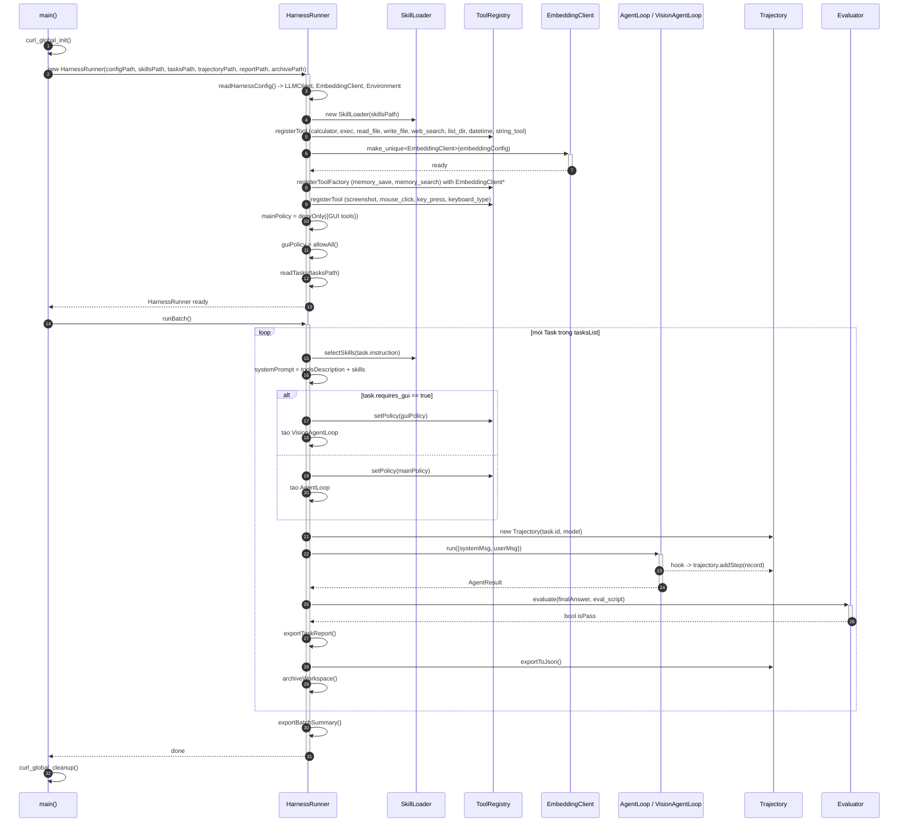

```mermaid
sequenceDiagram
    autonumber
    participant Main as main()
    participant HR as HarnessRunner
    participant SL as SkillLoader
    participant TR as ToolRegistry
    participant EC as EmbeddingClient
    participant AL as AgentLoop / VisionAgentLoop
    participant TJ as Trajectory
    participant EV as Evaluator

    Main ->> Main: curl_global_init()
    Main ->>+ HR: new HarnessRunner(configPath, skillsPath, tasksPath, trajectoryPath, reportPath, archivePath)
    HR ->> HR: readHarnessConfig() -> LLMClient, EmbeddingClient, Environment
    HR ->> SL: new SkillLoader(skillsPath)
    HR ->> TR: registerTool (calculator, exec, read_file, write_file, web_search, list_dir, datetime, string_tool)
    HR ->>+ EC: make_unique<EmbeddingClient>(embeddingConfig)
    EC -->>- HR: ready
    HR ->> TR: registerToolFactory (memory_save, memory_search) with EmbeddingClient*
    HR ->> TR: registerTool (screenshot, mouse_click, key_press, keyboard_type)
    HR ->> HR: mainPolicy = denyOnly({GUI tools})
    HR ->> HR: guiPolicy = allowAll()
    HR ->> HR: readTasks(tasksPath)
    HR -->>- Main: HarnessRunner ready

    Main ->>+ HR: runBatch()

    loop moi Task trong tasksList
        HR ->> SL: selectSkills(task.instruction)
        HR ->> HR: systemPrompt = toolsDescription + skills

        alt task.requires_gui == true
            HR ->> TR: setPolicy(guiPolicy)
            HR ->> HR: tao VisionAgentLoop
        else
            HR ->> TR: setPolicy(mainPolicy)
            HR ->> HR: tao AgentLoop
        end

        HR ->> TJ: new Trajectory(task.id, model)

        HR ->>+ AL: run({systemMsg, userMsg})
        AL -->> TJ: hook -> trajectory.addStep(record)
        AL -->>- HR: AgentResult

        HR ->>+ EV: evaluate(finalAnswer, eval_script)
        EV -->>- HR: bool isPass

        HR ->> HR: exportTaskReport()
        HR ->> TJ: exportToJson()
        HR ->> HR: archiveWorkspace()
    end

    HR ->> HR: exportBatchSummary()
    HR -->>- Main: done

    Main ->> Main: curl_global_cleanup()
```
